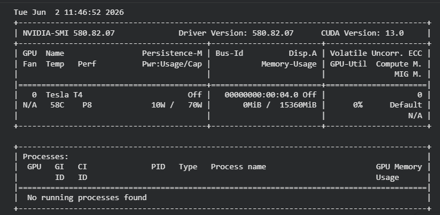
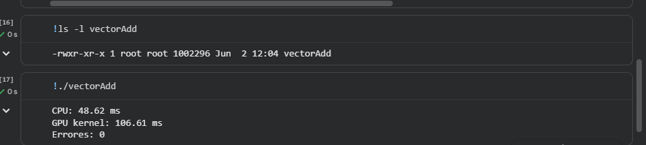
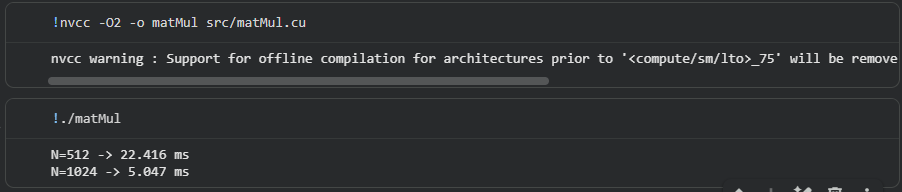

%%writefile README.md
# Post-Contenido 1 - Unidad 11

## Estudiante
Nombre: Yulian Andres Ortega Machado-1152485

## Descripción

Repositorio correspondiente al laboratorio de introducción a CUDA.

El objetivo es comparar la ejecución de algoritmos en CPU y GPU utilizando:

- Suma de vectores (vectorAdd)
- Multiplicación de matrices (matMul)

## Estructura

src/
capturas/

## Estado

Proyecto inicializado.
## Entorno de Ejecución

Las pruebas fueron realizadas utilizando Google Colab con aceleración por GPU.

### Hardware

- GPU: NVIDIA Tesla T4
- Memoria GPU: 15 GB

### Software

- CUDA Version: 13.0
- NVCC Version: 12.8
- GCC Version: 15.2.0
- Sistema Operativo: Ubuntu Linux (Google Colab)

### Evidencia

## Checkpoint 1 - Vector Addition con CUDA

Se implementó un kernel CUDA para realizar la suma de dos vectores de tamaño 2^24. La aplicación compara el tiempo de ejecución de una versión secuencial en CPU con una versión paralela ejecutada en GPU utilizando CUDA.

### Resultado obtenido

| Métrica | Valor |
|----------|----------:|
| CPU | 48.62 ms |
| GPU Kernel | 106.61 ms |
| Errores | 0 |

### Análisis

La ejecución confirmó que la implementación CUDA produce resultados correctos, ya que no se detectaron diferencias entre los resultados generados por CPU y GPU. Para esta prueba específica, el tiempo del kernel GPU fue superior al tiempo obtenido en CPU. Este comportamiento puede explicarse por los costos asociados al lanzamiento del kernel y a la gestión de la ejecución paralela, los cuales pueden ser significativos cuando la carga de trabajo no es suficientemente grande para aprovechar completamente el paralelismo de la GPU.

### Evidencia

## Checkpoint 2 - Multiplicación de matrices con Shared Memory

Se implementó un kernel CUDA para la multiplicación de matrices cuadradas utilizando memoria compartida (Shared Memory). El algoritmo divide las matrices en bloques de 16×16 elementos y carga dichos bloques en memoria compartida para reducir los accesos a memoria global, mejorando la reutilización de datos entre los hilos de un mismo bloque.

### Resultados obtenidos

| Tamaño de matriz | Tiempo GPU (ms) |
|------------------|----------------:|
| 512 × 512 | 22.416 |
| 1024 × 1024 | 5.047 |

### Análisis

La implementación emplea la técnica de tiling mediante Shared Memory, una optimización fundamental en CUDA para operaciones matriciales. Esta estrategia permite que los hilos reutilicen datos cargados previamente, disminuyendo la latencia asociada a los accesos repetidos a memoria global.

Los resultados obtenidos muestran que la GPU ejecutó correctamente la multiplicación de matrices para ambos tamaños evaluados. La diferencia observada entre los tiempos puede atribuirse a factores propios de la ejecución en GPU, como la inicialización de recursos, optimizaciones internas del controlador y variaciones en la planificación de los bloques durante las primeras ejecuciones.

### Evidencia

## Checkpoint 3 - Análisis General

Durante el desarrollo del laboratorio se implementaron y evaluaron diferentes programas CUDA con el propósito de comprender el modelo de ejecución paralelo basado en GPU. Se verificó el funcionamiento correcto de la suma de vectores mediante la comparación de resultados entre CPU y GPU, obteniendo cero errores en la validación.

Posteriormente se implementó la multiplicación de matrices utilizando memoria compartida (Shared Memory). Esta técnica permite reducir accesos repetidos a memoria global y constituye una de las optimizaciones fundamentales para mejorar el rendimiento de aplicaciones CUDA.

Los experimentos realizados evidencian la importancia de la organización de hilos, bloques y jerarquías de memoria dentro de la arquitectura CUDA. Asimismo, muestran que el rendimiento de una GPU depende tanto de la cantidad de trabajo computacional como de los costos asociados a la transferencia de datos y al lanzamiento de kernels.

## Conclusiones

1. CUDA permite aprovechar el paralelismo masivo de las GPU mediante la ejecución simultánea de miles de hilos.

2. La administración correcta de memoria mediante `cudaMalloc`, `cudaMemcpy` y `cudaFree` es fundamental para el desarrollo de aplicaciones CUDA.

3. El uso de Shared Memory mejora la eficiencia de algoritmos intensivos en acceso a memoria al reducir la latencia de acceso a datos.

4. La multiplicación de matrices representa un ejemplo clásico donde las optimizaciones basadas en tiling permiten incrementar el aprovechamiento de los recursos de la GPU.

5. El laboratorio permitió comprender los conceptos básicos de programación CUDA, incluyendo kernels, bloques, hilos, transferencia de memoria y optimización mediante memoria compartida.

## Capturas

### Entorno CUDA

### Checkpoint 1 - Vector Addition

### Checkpoint 2 - Matrix Multiplication

